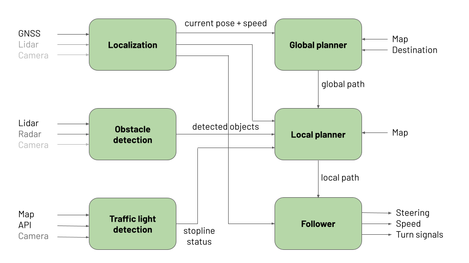
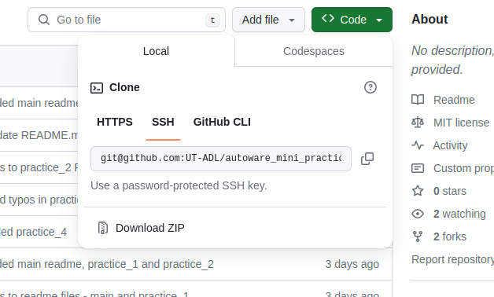

# Autoware Mini Course

This repo serves as an introduction to Autoware Mini. There are 8 practices that introduce the principles of main modules of Autoware Mini.

## Practices

| Practice | Topic                   |
|----------|-------------------------|
|    1     | [Introduction to ROS](practice_1)     |
|    2     | [Localizer](practice_2)               |
|    3     | [Controller](practice_3)              |
|    4     | [Global planner](practice_4)          |
|    5     | [Obstacle detection](practice_5)      |
|    6     | [Local planner](practice_6)           |
|    7     | [Traffic light detection](practice_7) |
|    8     | [CARLA simulator](practice_8)         |

## Using Git

#### GitHub account

* You should have your own [GitHub account](https://github.com/)
* You should set up the private key to make working with GitHub easier
   * [Generate private key](https://docs.github.com/en/authentication/connecting-to-github-with-ssh/generating-a-new-ssh-key-and-adding-it-to-the-ssh-agent)
   * [Copy public key to your GitHub account](https://docs.github.com/en/authentication/connecting-to-github-with-ssh/adding-a-new-ssh-key-to-your-github-account)
* When cloning the repo it is advised to use SSH link
* You can clone this repo with `git clone git@github.com:UT-ADL/autoware_mini_practice` to test if everything works correctly

#### Basic git commands

* git commands you should be familiar with:
   * `git add .`
   * `git commit -m "your commit message"`
   * `git push`
   * `git pull`
* We suggest regularily pushing your work into your GitHub repo.
* All the assesment of your progress will be done by reviewing your code in your GitHub repo created in Practice 1.
