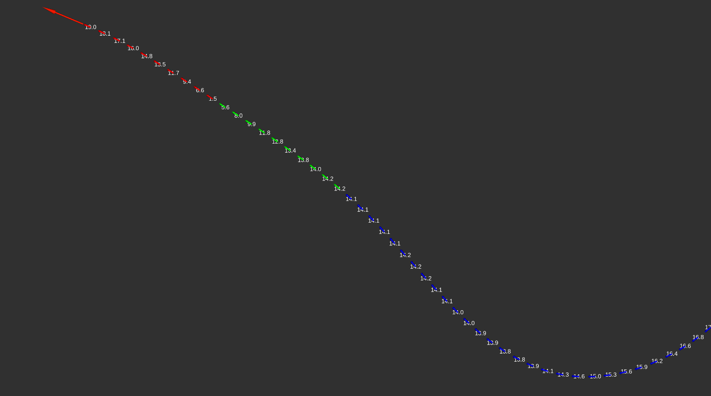

[< Previous practice](../practice_1) -- [**Main Readme**](../README.md) -- [Next practice >](../practice_3/)

# Practice 2 - Localizer

The primary task of the localizer is to determine the vehicle's position on the map. This can be done using GNSS ([Global Navigation Satellite System](https://en.wikipedia.org/wiki/Satellite_navigation)), lidar, or a camera. In this practice, we focus on localization using GNSS, which is the easiest to implement and suffices for simpler experiments.

In this practice, we will use logged data from the car [Novatel PwrPak7D](https://novatel.com/products/receivers/enclosures/pwrpak7d) GNSS sensor. The Novatel system combines the absolute GNSS positions with relative IMU (Inertial Measurement Unit) measurements to improve accuracy. The accuracy is further enhanced by using stationary ground base stations within RTK ([Real-Time Kinematic](https://en.wikipedia.org/wiki/Real-time_kinematic_positioning)) system. In addition to location, it also determines the speed of the vehicle from consecutive locations.

The data is saved in the rosbag file in the `autoware_mini` package. The GNSS log is recorded in the `/novatel/oem7/inspva` topic. This topic includes two kinds of data:
* **location**, given as latitude, longitude, and height,
* **velocity**, given in north, east, and up directions.

The task of the localizer in this case is straightforward - it must take the latitude and longitude, coordinates in [WGS84 system](https://en.wikipedia.org/wiki/World_Geodetic_System), and convert them to the map coordinate system. We use the UTM (Universal Transverse Mercator) zone 35N projection for the map. Using projection to [Cartesian coordinate system](https://en.wikipedia.org/wiki/Cartesian_coordinate_system) is common in processing geospatial data, making calculating distances between points and other transformations much easier.

#### Additionally provided files:

From this practice, we will provide some supporting files in this repository that you need to download (or clone the repository) and put in the corresponding directories inside your `autoware_mini_practice_solutions` folder.

* [launch/practice_2.launch](launch/practice_2.launch) - a launch file that should run without errors at the end of the practice using your localizer node and also launch waypoint recording
* [rviz/practice_2.rviz](rviz/practice_2.rviz) - RViz config file for visualizing the topics. RViz is a 3D visualization tool for ROS.
* [config/localization.yaml](config/localization.yaml) - some parameter values for localizer. Instead of using a launch file to set parameter values, a file can be loaded where the parameters are listed.

If you want to perform and/or validate these and the next practices on your own hardware, you need to do some additional steps:

* Follow all steps to install [autoware_mini](https://github.com/UT-ADL/autoware_mini)
* Download necessary [.bag files](https://owncloud.ut.ee/owncloud/s/AC8FHNNqG2ye95e) for practices and unpack files in `autoware_mini/data/bags`

### Expected outcome

* Understanding what it means to localize a car on the map
* Your localizer node will convert the measured location from the GNSS system frame to map coordinates
* As a result, we can record a trajectory of the car into a .csv file and can make the car follow that trajectory in the next practice


## 0. Combine workspaces

During practices, we will often reuse utility nodes and data files from the main `autoware_mini` workspace. To streamline the process, we want to combine the previously created workspace with the main one. Luckily, this is very easy to do by just copying the source files.

* `cp -rp ~/autoware_mini_practice/src/autoware_mini_practice_solutions/ ~/autoware_mini_ws/src/` - Copy files and github repo under new workspace
* `cd ~/autoware_mini_ws` 
* `catkin build` - Will rebuild packages in a shared workspace, you should now see `autoware_mini_practice_solutions` among the list of built packages
* `source devel/setup.bash` - important to source your newly built workspace with the new package
* If you have added in previous practice `source ~/autoware_mini_practice/devel/setup.bash` to your `~/.bashrc` file, then you need to edit the line to point to the source file of your new combined workspace instead. 

Open `practice_2.launch` and analyze it. You can notice that it shows from which package every executable node comes: we reuse `waypoint_saver.py` from `autoware_mini` package, and in addition, we reuse some nodes from general ROS packages such as `rviz`. 

Finally, we want to add some dependencies to our `package.xml` file to cover references to external packages we will use in these practices. Open the file and add the following code after the `<exec_depend>std_msgs</exec_depend>` line.

```
  <exec_depend>tf</exec_depend>
  <exec_depend>tf2_ros</exec_depend>
  <exec_depend>python3-pyproj</exec_depend>
  <exec_depend>message_filters</exec_depend>
  <exec_depend>python3-sklearn</exec_depend>
  <exec_depend>python3-numpy</exec_depend>
  <exec_depend>geometry_msgs</exec_depend>
  <exec_depend>novatel_oem7_msgs</exec_depend>
  <exec_depend>visualization_msgs</exec_depend>
  <exec_depend>pcl_ros</exec_depend>
  <exec_depend>topic_tools</exec_depend>
  <exec_depend>nodelet</exec_depend>
  <exec_depend>common</exec_depend>
  <exec_depend>rviz</exec_depend>
  <exec_depend>robot_state_publisher</exec_depend>
```

Rebuild and re-source the workspace. Don't forget to commit and push changes.

## 1. Create a localizer node

We will create a [subscriber node](https://wiki.ros.org/ROS/Tutorials/WritingPublisherSubscriber%28python%29#rospy_tutorials.2FTutorials.2FWritingPublisherSubscriber.Writing_the_Subscriber_Node). The node will get access to the data when we will [play a rosbag](https://wiki.ros.org/rosbag/Commandline#rosbag_play).

##### Instructions
1. Create a new file called `localizer.py` inside `~/autoware_mini_ws/src/autoware_mini_practice_solutions/nodes/localization`
2. Copy the following code as a starting point to your node. What to note:
   - See how the node is organized as a class - it is a good practice to agree on some common style when writing a code. Let this be an example of current good practice
      - ROS node is created in [`if __name__ == '__main__':`](https://docs.python.org/3/library/__main__.html#idiomatic-usage) block and then class method `run()` is called
      - Organize the code in meaningful groups in the class init method 
      - Other code should be inside callbacks and functions
   - Go through the necessary imports and note different message types
   - Notice that we don't use a prefix for parameter names this time. This is because these parameters can be used from other nodes. Previously, we used the `~` prefix that denotes node private parameters. More information on resolving parameter names can be found [here](http://wiki.ros.org/Names#Resolving).
   - See how subscribers and publishers are created
3. There is an empty callback: `transform_coordinates` - replace `pass` with printing the coordinates `print(msg.latitude, msg.longitude)`

```
#!/usr/bin/env python3

import math
import rospy

from tf.transformations import quaternion_from_euler
from tf2_ros import TransformBroadcaster
from pyproj import CRS, Transformer, Proj

from novatel_oem7_msgs.msg import INSPVA
from geometry_msgs.msg import PoseStamped, TwistStamped, Quaternion, TransformStamped

class Localizer:
    def __init__(self):

        # Parameters
        # self.undulation = rospy.get_param('undulation')
        # utm_origin_lat = rospy.get_param('utm_origin_lat')
        # utm_origin_lon = rospy.get_param('utm_origin_lon')

        # Internal variables
        self.crs_wgs84 = CRS.from_epsg(4326)
        self.crs_utm = CRS.from_epsg(25835)
        self.utm_projection = Proj(self.crs_utm)

        # Subscribers
        rospy.Subscriber('/novatel/oem7/inspva', INSPVA, self.transform_coordinates)

        # Publishers
        self.current_pose_pub = rospy.Publisher('current_pose', PoseStamped, queue_size=10)
        self.current_velocity_pub = rospy.Publisher('current_velocity', TwistStamped, queue_size=10)
        self.br = TransformBroadcaster()

    def transform_coordinates(self, msg):
        pass

    def run(self):
        rospy.spin()

if __name__ == '__main__':
    rospy.init_node('localizer')
    node = Localizer()
    node.run()
```

##### Validation
* As a reminder, let's run first all the nodes manually
* In terminal 1: `roscore`
* In terminal 2: `rosbag play ride_14_minimal.bag` - need to be in the same folder where the rosbag is, or enter it with the relative path. Bag files are under `autoware_mini` package directory `data/bags`. You can pause the playback with `space` key and resume with the same key in the terminal.
* In terminal 3: run the localizer node (`python localizer.py`) and see if the coordinates printed out are roughly similar to the following:

```
latitude:  58.377320927441524  longitude:  26.73093522060624
latitude:  58.37732063697093  longitude:  26.730934613622136
latitude:  58.377320343735214  longitude:  26.730933999096404
...
```
* Close all running processes in terminals
* Inside the localizer node in the parameters section, uncomment getting the three parameter values (`undulation`, `utm_origin_lat`, `utm_origin_lon`)
* run `roslaunch autoware_mini_practice_solutions practice_2.launch`
   - We should see the same coordinates printed out in the console
   - All necessary things like playing the rosbag, running the localizer node, and opening RViz with visualization are included in the launch file.


## 2. Convert coordinates

Latitude and longitude printed out in the previous task are geographic coordinates in [World Geodetic System](https://en.wikipedia.org/wiki/World_Geodetic_System) (with [EPSG code 4326](https://epsg.io/4326)), or more commonly referred to as GPS coordinates. Our localizer needs to transform these coordinates to UTM zone 35N projection ([with EPSG code 25835](https://epsg.io/25835)) as used for the map. Additionally, we have defined a custom origin point near the Delta building that needs to be subtracted from transformed coordinates. We use the [pyproj](https://pyproj4.github.io/pyproj/stable/) library for coordinate transformations.

##### Instructions
1. Create the coordinate [Transformer](https://pyproj4.github.io/pyproj/stable/api/transformer.html) using the defined [CRS](https://pyproj4.github.io/pyproj/stable/api/crs/crs.html) objects.
2. Use the Transformer to transform the origin point (so that it can be later subtracted from the transformed coordinates).
3. Both of the previous should be done only once in the class initialization 

```
# create a coordinate transformer
self.transformer = Transformer.from_crs(self.crs_wgs84, self.crs_utm)
self.origin_x, self.origin_y = self.transformer.transform(utm_origin_lat, utm_origin_lon)
```
4. `self.transformer` can also be used inside the callback to transform the coordinates from INSPVA message
5. Add also subtracting the transformed origin coordinates, and replace the previous printout in the callback with the current results


##### Validation
* run `roslaunch autoware_mini_practice_solutions practice_2.launch`
* Output should be similar to this:

```
x:  269.20194537803764 y:  -894.3992087505758
x:  269.1676822404843 y:  -894.4305393118411
x:  269.1329317893251 y:  -894.4622026216239
...
```

## 3. Publish `current_pose`

As a next step, we must publish transformed coordinates to a `current_pose` topic. The message type for this topic is [PoseStamped](https://docs.ros.org/en/melodic/api/geometry_msgs/html/msg/PoseStamped.html). When you look at the message definition, it contains:
   * [Header message](https://docs.ros.org/en/noetic/api/std_msgs/html/msg/Header.html) that has
      * `seq` - sequence id, int number that is increasing with every sent message
      * `stamp` - contains the timestamp of the message of type **time**
      * `frame_id` - reference frame name. Right now, we will put just `map` here; reference frames will be explained more in future practices.
   * [Pose message](https://docs.ros.org/en/melodic/api/geometry_msgs/html/msg/Pose.html) consists of two parts, each referring to another message type:
      * `position` (message type [geometry_msgs/Point](https://docs.ros.org/en/melodic/api/geometry_msgs/html/msg/Point.html))
         - `position.x` and `position.y` are the transformed coordinates with subtracted origin coordinates
         - For `position.z`, we must take `msg.height` and subtract `undulation`. Undulation is the parameter used to correct for differences in height measurements between the shapes of the ellipsoids/geoids used to represent Earth's shape in different coordinate systems. For more details, see the following [article](https://globalgpssystems.com/gnss/geoids-ellipsoids-and-undulation-height-understanding-the-basics/)
      * `orientation` (message type [geometry_msgs/Quaternion](https://docs.ros.org/en/melodic/api/geometry_msgs/html/msg/Quaternion.html)). Quaternions are a way to represent orientations in 3D space that have [many favorable properties](https://en.wikipedia.org/wiki/Quaternions_and_spatial_rotation).
         * From the GNSS topic, we have azimuth angle in degrees - angle from north in clockwise direction (we will be ignoring the car's roll and pitch angles currently). Essentially, we need to convert the azimuth angle to a quaternion.
         * GNSS azimuth is in the WGS84 system; we must first correct it for the UTM zone 35N projection. The correction depends on location and is known as [meridian convergence](https://en.wikipedia.org/wiki/Transverse_Mercator_projection#Convergence). This can be found with the [get_factors](https://pyproj4.github.io/pyproj/stable/api/proj.html#pyproj.Proj.get_factors) method, see the example code below. The correction should be subtracted from the azimuth angle coming from the message.
         * Next thing is we need to convert angle from **clockwise (CW)** angle from **y axis** (north) to **counterclocḱwise (CCW)** angle from **x-axis** (this is how angles are usually represented in ROS). Let's call this angle **yaw**. The function `convert_azimuth_to_yaw()` is provided in the code below. Note: the function takes corrected azimuth input in radians.
         * Finally, we need to convert the angle to a quaternion; you can use the `quaternion_from_euler` for that.

```
# calculate azimuth correction
azimuth_correction = self.utm_projection.get_factors(msg.longitude, msg.latitude).meridian_convergence

# convert azimuth to yaw angle
def convert_azimuth_to_yaw(azimuth):
    """
    Converts azimuth to yaw. Azimuth is CW angle from the north. Yaw is CCW angle from the East.
    :param azimuth: azimuth in radians
    :return: yaw in radians
    """
    yaw = -azimuth + math.pi/2
    # Clamp within 0 to 2 pi
    if yaw > 2 * math.pi:
        yaw = yaw - 2 * math.pi
    elif yaw < 0:
        yaw += 2 * math.pi

    return yaw

# Convert yaw to quaternion
x, y, z, w = quaternion_from_euler(0, 0, yaw)
orientation = Quaternion(x, y, z, w)
```

##### Instructions
1. Create the PoseStamped() message
2. Use previously provided code to calculate x, y, z values and orientation
3. `stamp` should be taken from the INSPVA message header
4. `frame_id` should be `"map"`
5. Publish `current_pose`

```
# publish current pose
current_pose_msg = PoseStamped()
current_pose_msg.header.stamp = 
current_pose_msg.header.frame_id = 
current_pose_msg.pose.position.x = 
current_pose_msg.pose.position.y = 
current_pose_msg.pose.position.z = 
current_pose_msg.pose.orientation = 
self.current_pose_pub.publish(current_pose_msg)
```


##### Validation
* run `roslaunch autoware_mini_practice_solutions practice_2.launch`
* `rostopic echo /localization/current_pose` should see messages published similar to this:

```
header: 
  seq: 1420
  stamp: 
    secs: 1698739108
    nsecs: 206858580
  frame_id: "map"
pose: 
  position: 
    x: 206.55750858492684
    y: -861.8742412924767
    z: 34.15901836518278
  orientation: 
    x: 0.0
    y: 0.0
    z: 0.9144929346097534
    w: 0.4046018691860446
```

## 4. Publish `current_velocity`

Velocity is represented in `/novatel/oem7/inspva` messages with three components: `north_velocity`, `east_velocity`, and `up_velocity`. We will use only the north and east components and take their norm.

Message type in `current_velocity` is [TwistStamped](https://docs.ros.org/en/melodic/api/geometry_msgs/html/msg/TwistStamped.html), and we are going to write the calculated velocity to `twist.linear.x` and say that `header.frame_id` equals to `base_link`. `base_link` is a common way to name the robot's/car's main reference frame where the x axis points forward. That is why we calculate the norm and write it only to `twist.linear.x`.

##### Instruction
1. Calculate the velocity as the norm of the `north_velocity` and `east_velocity`
2. Create TwistStamped message
3. Create the message 
   * Set frame as `"base_link"` 
   * Take a time stamp from the GNSS message
   * Assign velocity to `msg.twist.linear.x`
4. Publish to `current_velocity`

##### Validation
* run `roslaunch autoware_mini_practice_solutions practice_2.launch`
* `rostopic echo /localization/current_velocity`, similar messages should appear


```
header: 
  seq: 567
  stamp: 
    secs: 1698739091
    nsecs: 147263737
  frame_id: "base_link"
twist: 
  linear: 
    x: 3.9187759208925708
    y: 0.0
    z: 0.0
  angular: 
    x: 0.0
    y: 0.0
    z: 0.0

```


## 5. Create and publish a transform

Lastly, our localizer must publish the transformation between the `map` frame and the `base_link` frame. This allows later conversion of map coordinates (e.g., traffic light locations) to vehicle local coordinates (e.g., in camera reference frame).

For that, you need to use [TransformBroadcaster() from tf2_ros](https://wiki.ros.org/tf2/Tutorials/Writing%20a%20tf2%20broadcaster%20%28Python%29) library. That is already imported and created. It uses message type: [geometry_msgs/TransformStamped](https://docs.ros.org/en/melodic/api/geometry_msgs/html/msg/TransformStamped.html)

1. Create the TransformStamped message
   - `frame_id` is `map`
   - `child_frame_id` should be `base_link`
   - timestamp should come from the GNSS message
2. Transform consists of translation and rotation, which are the current_pose's position and orientation. Basically, to convert (0, 0) in `base_link` frame to `map` frame, you need to add the current position.
3. Use `sendTransform()` to publish the transform (TransformStamped message)


```
# create a transform message
t = TransformStamped()

# fill in the transform message - t

# publish transform
self.br.sendTransform(t)

```

##### Validation 
* `roslaunch autoware_mini_practice_solutions practice_2.launch`
* Rviz should open with a similar visualization. Location information is replayed from the rosbag, your localization node transforms them into UTM Zone 35N coordinates, and also, waypoint recording is launched.



* The big red arrow in front is the location of `current_pose`
* Smaller arrows depict the recorded waypoints; the waypoint itself is at the beginning of the arrow, and the arrow shows the orientation
* The white number on top of the waypoints shows speed in km/h
* The color of the waypoint arrow shows the blinker
   - blue - right turn
   - green - straight
   - red - left turn

If you open the recorded .csv file in `autoware_mini/data/trajectories` folder, then the contents should look like this:
```
x,y,z,yaw,velocity,change_flag,steering_flag,accel_flag,stop_flag,event_flag
268.60110718221404,-894.9431115202606,34.66950587444008,-138.0360894928333,2.7723594859024563,0,0,0,0,0
267.84536724333884,-895.635495165363,34.67847024351359,-138.0351092682738,3.2647263562356508,0,2,0,0,0
267.0734381066868,-896.34648047667,34.6812903245911,-138.07574386142207,3.7157067324175,0,2,0,0,0
266.3270506322733,-897.026044420898,34.71393044367433,-137.97208005347792,4.065691569884165,0,2,0,0,0
265.5763419162831,-897.7114233719185,34.72044138591737,-137.83120457759426,4.3996406220710504,0,2,0,0,0
...
```
* `x,y,z` - waypoint coordinates in map frame
* `yaw` - yaw angle in degrees (CCW from x-axis). A negative angle "turns the direction around"
* `velocity` - speed of the car
* `steering_flag` - blinker information
* Other columns are currently not used


## 6. Launch file arguments

If you open the launch file, you can see three arguments in the beginning
* `bag_file` - specify the bag file name
* `interval` - define spacing between waypoints
* `waypoints_file` - define output waypoints file name

These arguments can be specified when you run the launch file. The tab key is beneficial here because it auto-completes. Try to enter the same roslaunch command `roslaunch autoware_mini_practice_solutions practice_2.launch` by hitting the tab key at various steps.

Additionally, enter the tab key at the end and see the arguments appear. For example, try the command with arguments `roslaunch autoware_mini_practice_solutions practice_2.launch interval:=5 waypoints_file:=waypoints_5m.csv`
