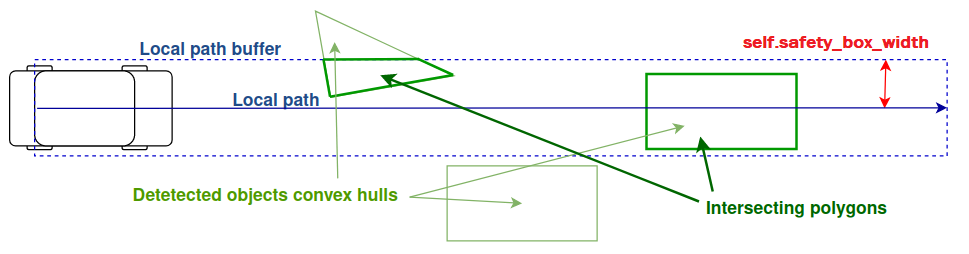
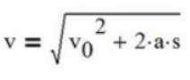
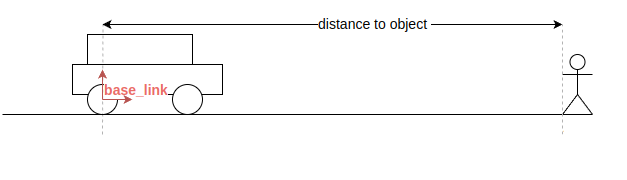
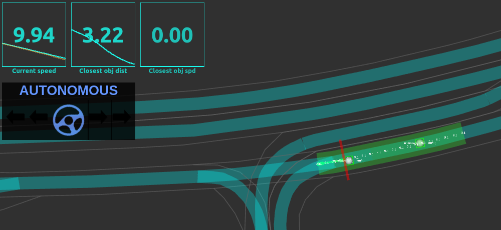
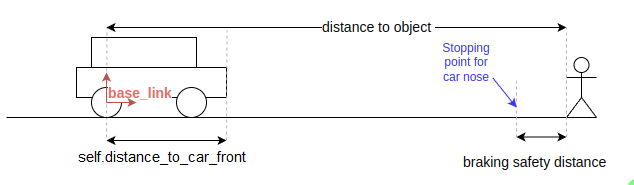
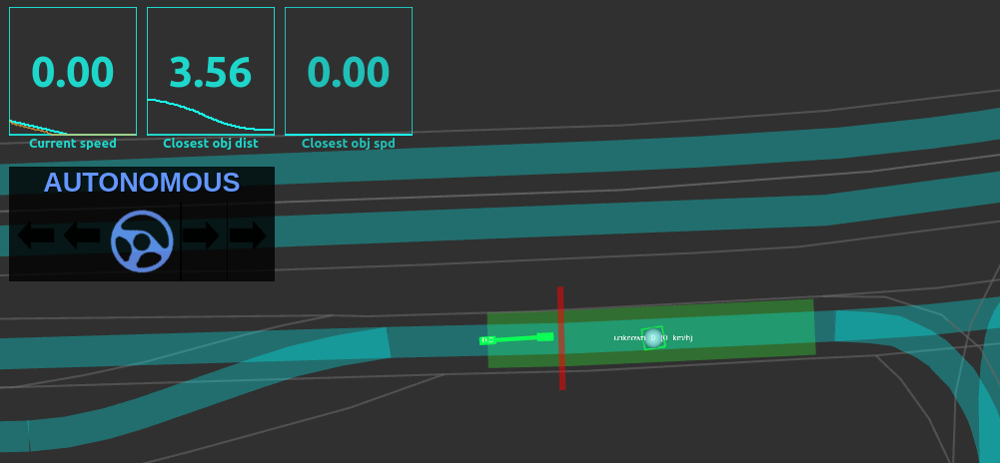
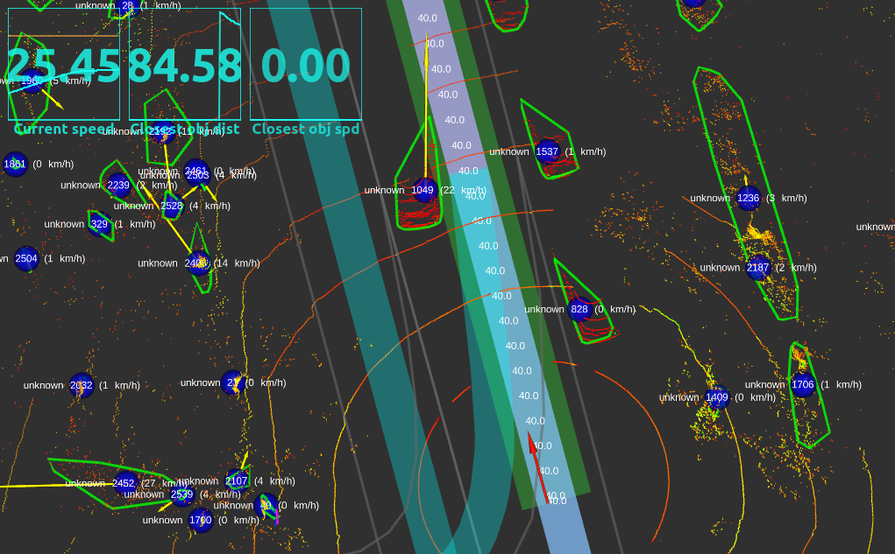
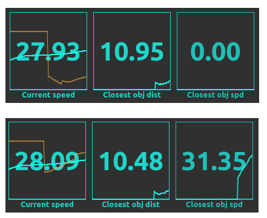
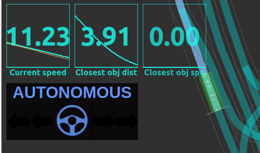

[< Previous practice](../practice_5) -- [**Main Readme**](../README.md) -- [Next practice >](../practice_7)

# Practice 6 - Local planning

In this exercise, you will create a local planning module that focuses on extracting and refining a local path from a global path. The global path will be used to identify any **collision points** along the way by the object collision checker (and other) nodes, and the speed planner node will respond by safely decreasing the speed of the ego vehicle. **Collision points** are generalization of potential obstacles and any other conditions that require a modification of the target speed set by the global planner. In this practice you will learn how to process two types of collision points: object obstacles and goal point.

For the safe and comfortable driving, the vehicle might need to come to a complete stop or follow another vehicle within a safe distance. To achieve this, the speed planner node will regulate the speed of the ego vehicle by calculating a suitable target velocity whenever new information about new collision points is received. This process is also known as longitudinal control, which is responsible for controlling the speed of an ego vehicle.

For this exercise, the local planner will not receive any lateral control tasks, such as swerving around an obstacle or planning a lane change. Lateral control, which is needed for following a pre-planned path, will remain the controller's responsibility. Throughout this exercise, the local planner node will only control speed.

#### Additional files
- [launch/practice_6_bag.launch](launch/practice_6_bag.launch) - first launch file that reads data from bag that should run without errors at the end of the practice
- [launch/practice_6_sim.launch](launch/practice_6_sim.launch) - second launch file that creates simulation that should run without errors at the end of the practice
- [rviz/practice_6.rviz](rviz/practice_6.rviz) - RViz config file for visualizing the topics.
- [config/planning.yaml](config/planning.yaml) - Updated config file, overwrite your local config file, don't forget to set your own custom values back.

### Expected outcome
* Understanding the concept of collision points and how do you want to process different types of them
* Understanding of how the ego vehicle reacts to the collision points (combination of distance and speed).
* The local planner will take over the ego vehicle's longitudinal (speed) control by reacting to the obstacles and goal points and writing the target velocity to the local path. The controller will just take it from there and use it as is.


## 1. Preparation

The first step of local planner is creating a small node that will extract a small portion of global path that starts at our ego-vehicle position. This way we only need to consider collision points on this portion instead of the whole global path. We also need this local path to be published at the constant rate, when previously global path was published only when goal changes (think about why).

1. Create a new file, `local_path_extractor.py` under `nodes/planning/local`
2. copy the following code:

 ```
#!/usr/bin/env python3

import rospy
import threading
import traceback
import shapely
import math
import numpy as np
from scipy.interpolate import interp1d
from autoware_mini.msg import Path, Waypoint
from geometry_msgs.msg import PoseStamped

class LocalPathExtractor:

    def __init__(self):

        # parameters
        self.publish_rate = rospy.get_param("~publish_rate")
        self.local_path_length = rospy.get_param("local_path_length")

        # variables
        self.current_pose = None
        self.global_path_xyz = None
        self.global_path_linestring = None
        self.global_path_velocities = None
        
        # Lock for thread safety
        self.lock = threading.Lock()

        # timer
        rospy.Timer(rospy.Duration(1 / self.publish_rate), self.extract_local_path)
        
        # publishers
        self.local_path_pub = rospy.Publisher('extracted_local_path', Path, queue_size=1, tcp_nodelay=True)

        # subscribers
        rospy.Subscriber('/localization/current_pose', PoseStamped, self.current_pose_callback, queue_size=1,
                         tcp_nodelay=True)
        rospy.Subscriber('global_path', Path, self.global_path_callback, queue_size=None, tcp_nodelay=True)

    def current_pose_callback(self, msg):
        self.current_pose = msg

    def global_path_callback(self, msg):
        if len(msg.waypoints) == 0:
            with self.lock:
                self.global_path_xyz = None
                self.global_path_linestring = None
                self.global_path_velocities = None
            rospy.loginfo("%s - Empty global path received", rospy.get_name())
        else:
            with self.lock:
                self.global_path_xyz =  np.array([(waypoint.position.x, waypoint.position.y, waypoint.position.z) for waypoint in msg.waypoints])
                self.global_path_linestring = shapely.LineString(self.global_path_xyz)
                self.global_path_velocities = np.array([waypoint.speed for waypoint in msg.waypoints])
            rospy.loginfo("%s - Global path received with %i waypoints", rospy.get_name(),
                          len(self.global_path_xyz))

    def extract_local_path(self, _):
        try:
            with self.lock:
                current_pose = self.current_pose
                global_path_xyz = self.global_path_xyz
                global_path_linestring = self.global_path_linestring
                global_path_velocities = self.global_path_velocities

            if current_pose is None:
                return

            local_path = Path()
            local_path.header = current_pose.header

            if global_path_xyz is None:
                self.local_path_pub.publish(local_path)
                return
               
            print('Current pose:', current_pose.pose.position.x, current_pose.pose.position.y, current_pose.pose.position.z)
            return

            current_position = None

            ego_distance_from_global_path_start = None

            global_path_distances = None

            global_path_velocities_interpolator = None

            # extract local path using distances and velocities interpolator
            local_path_waypoints = self.extract_waypoints(global_path_linestring, global_path_distances, ego_distance_from_global_path_start, self.local_path_length, global_path_velocities_interpolator)

            local_path = Path()
            local_path.header = current_pose.header
            local_path.waypoints = local_path_waypoints

            self.local_path_pub.publish(local_path)
        except Exception as e:
            rospy.logerr_throttle(10, "%s - Exception in callback: %s", rospy.get_name(), traceback.format_exc())


    def extract_waypoints(self, global_path_linestring, global_path_distances, d_ego_from_path_start, local_path_length, global_path_velocities_interpolator):

        # current position is projected at the end of the global path - goal reached
        if math.isclose(d_ego_from_path_start, global_path_linestring.length):
            return None

        d_to_local_path_end = d_ego_from_path_start + local_path_length

        # find index where distances are higher than ego_d_on_global_path
        index_start = np.argmax(global_path_distances >= d_ego_from_path_start)
        index_end = np.argmax(global_path_distances >= d_to_local_path_end)

        # if end point of local_path is past the end of the global path (returns 0) then take index of last point
        if index_end == 0:
            index_end = len(global_path_linestring.coords) - 1

        # create local path from global path add interpolated points at start and end, use sliced point coordinates in between
        start_point = global_path_linestring.interpolate(d_ego_from_path_start)
        end_point = global_path_linestring.interpolate(d_to_local_path_end)
        local_path_xyz = start_point.coords[:] + list(global_path_linestring.coords[index_start:index_end]) + end_point.coords[:]
        local_path_distances = [d_ego_from_path_start] + list(global_path_distances[index_start:index_end]) + [d_to_local_path_end]

        local_path_waypoints = []
        for i in range(len(local_path_xyz)):
            waypoint = Waypoint()
            waypoint.position.x = local_path_xyz[i][0]
            waypoint.position.y = local_path_xyz[i][1]
            waypoint.position.z = local_path_xyz[i][2]
            waypoint.speed = global_path_velocities_interpolator(local_path_distances[i])
            local_path_waypoints.append(waypoint)

        return local_path_waypoints

    def run(self):
        rospy.spin()


if __name__ == '__main__':
    rospy.init_node('local_path_extractor')
    node = LocalPathExtractor()
    node.run()
```

3. Scroll through the code and try to get a general understanding
   - What publishers and subscribers are created
   - What happens if the path is received (empty path vs not empty path)
   - We use `PathWrapper` class from Autoware Mini to wrap the path and add some additional functionality to it, simplifying conversion to linestring
   - We use ros [Timer](https://wiki.ros.org/rospy/Overview/Time#Timer) in order to have publisher publishing extracted small path at a specific rate (10 Hz by default) 
   - In order to safely transfer data between asynchronous subscriber callbacks and timed publisher callback Python [Lock](https://docs.python.org/3/library/threading.html#lock-objects) is used:


#### Validation
* Run `roslaunch autoware_mini_practice_solutions practice_6_sim.launch`
* After defining navigation goal for the vehicle: observe in the console, there is a repeated printout of your current pose from the function invoked by the timer that changes when you change the initial pose in Rviz:

    ```
    Current Pose: 0.0 0.0 34.5195995355058
    ```
* Run `rostopic hz /planning/extracted_local_path` and verify that the topic is published at the correct rate (10Hz by default)

## 2. Extract and publish the local path

The main logic of local path extraction is in `extract_waypoints` function. Your task is to calculate all the necessary input variables that are initiated as `None` in the `extract_local_path` function.

##### Instructions

1. Remove the `print` and `return` statements in the `extract_local_path` function.
2. Find the ego vehicle location from `current_pose` message copied in the start of the function and initiate it as Shapely `Point` variable.
3. Find the ego vehicle location on the global path as the distance from the global path start. Shapely `project` will find the closest point on the path and calculate the distance to it.
```
ego_distance_from_global_path_start = global_path.linestring.project(current_position)
```
4. Calculate `global_path_distances` as an array of cumulative sum of the distances (first point = cumulative distance of 0.0). Use `numpy` function `np.cumsum()` to do that.
5. Create interpolator `global_path_velocities_interpolator` using `interp1d` function from `scipy` library. Interpolator should use `global_path_distances` as x-coordinates and `global_path_velocities` as y-coordinates. This will the local path extractor to calculate precise target velocities for points that are not on the global path (mainly `current_pose` and `goal`).
6. After you initialize all parameters, `extract_waypoints` function will be called to extract the local path. The function will return a list of waypoints that is published in `Path` message in `/planning/extracted_local_path` topic.

##### Validation

* Run `roslaunch autoware_mini_practice_solutions practice_6_sim.launch`
* Place destination - path should appear, and ego vehicle starts to drive.
* Place obstacles on the path - ego vehicle will ignore them.
* Use `rostopic hz` to verify that `/control/vehicle_cmd` and `/planning/extracted_local_path` topics are published when the path is set and when the ego vehicle passes the goal point and the path is cleared.

## 3. Collision points creator node

The next task is to initialize node that will create collision points for our local planner to react to. In this practice, we are interested in processing obstacles detected by the object detection and creating collision points accordingly. We will use a buffer around extracted local path to check if any object is within the buffered local path. Shapely [intersects](https://shapely.readthedocs.io/en/stable/reference/shapely.intersects.html) and [intersection](https://shapely.readthedocs.io/en/stable/reference/shapely.intersection.html) functions can be used for this purpose.



##### Instructions

1. Create a new file `collision_points_manager.py` under `nodes/planning/local`
2. Copy the following code:

```
#!/usr/bin/env python3

import rospy
import shapely
import math
import numpy as np
import threading
from ros_numpy import msgify
from autoware_mini.msg import Path, DetectedObjectArray
from sensor_msgs.msg import PointCloud2

DTYPE = np.dtype([
    ('x', np.float32),
    ('y', np.float32),
    ('z', np.float32),
    ('vx', np.float32),
    ('vy', np.float32),
    ('vz', np.float32),
    ('distance_to_stop', np.float32),
    ('deceleration_limit', np.float32),
    ('category', np.int32)
])

class CollisionPointsManager:

    def __init__(self):

        # parameters
        self.safety_box_width = rospy.get_param("safety_box_width")
        self.stopped_speed_limit = rospy.get_param("stopped_speed_limit")
        self.braking_safety_distance_obstacle = rospy.get_param("~braking_safety_distance_obstacle")

        # variables
        self.detected_objects = None

        # Lock for thread safety
        self.lock = threading.Lock()

        # publishers
        self.local_path_collision_pub = rospy.Publisher('collision_points', PointCloud2, queue_size=1, tcp_nodelay=True)

        # subscribers
        rospy.Subscriber('extracted_local_path', Path, self.path_callback, queue_size=1, tcp_nodelay=True)
        rospy.Subscriber('/detection/final_objects', DetectedObjectArray, self.detected_objects_callback, queue_size=1, buff_size=2**20, tcp_nodelay=True)

    def detected_objects_callback(self, msg):
        self.detected_objects = msg.objects

    def path_callback(self, msg):
        with self.lock:
            detected_objects = self.detected_objects
        collision_points = np.array([], dtype=DTYPE)

        pass

    def run(self):
        rospy.spin()

if __name__ == '__main__':
    rospy.init_node('collision_points_manager')
    node = CollisionPointsManager()
    node.run()
```
3. Analyze the provided code, as always check the subscribed and published topics, and the ros parameters used in the code.
4. Collision Points in Autoware Mini are represented as a `PointCloud2` type message, that can hold any structured data array. In our case, we will use the `DTYPE` defined at the beginning of the file. It contains the following fields:
   - `x`, `y`, `z` - coordinates of the collision point
   - `vx`, `vy`, `vz` - velocity of the collision point
   - `distance_to_stop` - distance at which car should stop before the collision point, in case of moving collision points, this is the distance the car will follow them at the same speed
   - `deceleration_limit` - deceleration limit, different collision points tyoes require different severity for deceleration
   - `category` - category of the object, in these practices we are interested mainly in four categories: `0` - not an obstacle, `1` - goal point, `2` - traffic light' stop line, `3` - static obstacle, `4` - moving obstacle. These are mainly used for visualization purposes, while 2 previous parameters are used for the main speed planner logic.
5. Your task is to populate `path_callback` function that takes the extracted local path and detected objects and checks if any of the detected objects convex hulls are within the buffered local path. It then creates a `PointCloud2` message with the coordinates of the collision points - intersections, and publishes it.
6. Start by creation Shapely `Linestring` from the local path message. Don't forget to check if it is empty and if the detected objects are empty as well. In either of these cases, publish an empty `PointCloud2` message with header used in the local path message.
7. Buffer the local path `Linestring` using `buffer` method. The buffer width is defined in the `safety_box_width` parameter.
   - `cap_style` should be set to `flat` to avoid round corners
   - use `prepare` to speed up the intersection calculations of the resulting buffer
8. Iterate over detected objects and create Shapely `Polygon` from the object convex hull. Check if the resulting object intersects with the local path buffer.
9. Every intersections' geometry point represents a collision point. Use `shapely.get_coordinates` to get the coordinates of the intersection results, and for every point add a corresponding entry to `collision_points` array.

```
for x, y in intersection_points:
    collision_points = np.append(collision_points, np.array([(x, y, obj.position.z, obj.velocity.x, obj.velocity.y, obj.velocity.z,
                                                                                  self.braking_safety_distance_obstacle, np.inf, 3 if object_speed < self.stopped_speed_limit else 4)], dtype=DTYPE))
```
- Here we use normalized `obj_speed` comparison to `self.stopped_speed_limit` to determine if the object is moving or not. If the object is stopped, we set `category` to `3`, otherwise to `4`.
10. Finally create a `PointCloud2` message using `msgify` function on our structured data of collision points and copying the local path header.
11. For validation purposes, add a printout of the final `collision_points` array.

##### Validation

Part 1

* Run `roslaunch autoware_mini_practice_solutions practice_6_sim.launch`
* Local path should be exactly the with of the local path buffer
* Place destination and experiment by placing the simulated obstacles on the path and see 
   - how many collision points are printed out (try putting simulated obstacles on the edge of the local path buffer)
   - how many points are printed for one obstacle (4, 5, 6) (does it change when it is on buffer edge?)
* Hint: It might be useful to use `speed_limit` argument when running the launch file with low speed to be able to place the obstacles more conveniently. Try to achieve the polygons with different numbers of points.
* Verify that everything seems to work and is logical

Part 2

* Run `roslaunch autoware_mini_practice_solutions practice_6_bag.launch`
* Set the goal point along the driving direction
* Wait for the first intersection when the car turns in front of the ego vehicle, and it starts to print out the resulting coll. The first coordinates should be similar to the ones below:
 

   ```
    ['x: -120.533424', 'y: -362.6136', 'z: 36.177357', 'vx: 0.0', 'vy: 0.0', 'vz: 0.0', 'distance_to_stop: 4.0', 'deceleration_limit: inf', 'category: 3']
    ['x: -120.404625', 'y: -363.55096', 'z: 36.177357', 'vx: 0.0', 'vy: 0.0', 'vz: 0.0', 'distance_to_stop: 4.0', 'deceleration_limit: inf', 'category: 3']
    ['x: -120.35655', 'y: -363.93082', 'z: 36.177357', 'vx: 0.0', 'vy: 0.0', 'vz: 0.0', 'distance_to_stop: 4.0', 'deceleration_limit: inf', 'category: 3']
    ['x: -120.638954', 'y: -362.8749', 'z: 36.177357', 'vx: 0.0', 'vy: 0.0', 'vz: 0.0', 'distance_to_stop: 4.0', 'deceleration_limit: inf', 'category: 3']
    ['x: -120.533424', 'y: -362.6136', 'z: 36.177357', 'vx: 0.0', 'vy: 0.0', 'vz: 0.0', 'distance_to_stop: 4.0', 'deceleration_limit: inf', 'category: 3']
   ```
* You might notice that velocity values are 0.0 for moving object(s) in bag replay. This is caused by launch file not using the tracker node. You can turn it on by specifying `use_tracking:=true` as option in the command line and compare the results. 

## 4. Speed planner module

Now that we have collision points of the obstacle we need to teach our local planner to reach to them. We can achieve this by reducing target velocity in comparison to original global path target velocity, if we calculate that collision is going to happen. For now we assume that collision points are static and do not have their own velocity. In this case, we can use the following formula for the target velocity calculation:



* `v` - target velocity
* `v0` - object velocity
* `a` - acceleration / deceleration
* `s` - distance to object

We can calculate the collision point distance on the local path using Shapely `project` and apply it to all collision points, taking only the closest one. It will give the distance from the local path start, and as we extract the local path using the location of `current_pose` (origin of the `base_link` frame), we get the distance from `base_link`.




##### Instructions
1. Create the final node of our local planner, named `simple_speed_planner.py` under `nodes/planning/local`.
2. Copy the following code:

```
#!/usr/bin/env python3

import rospy
import math
import message_filters
import traceback
import shapely
import numpy as np
import threading
from numpy.lib.recfunctions import structured_to_unstructured
from ros_numpy import numpify
from autoware_mini.msg import Path, Log
from sensor_msgs.msg import PointCloud2
from geometry_msgs.msg import PoseStamped, TwistStamped, Vector3
from helpers.geometry import project_vector_to_heading, get_distance_between_two_points_2d


class SpeedPlanner:

    def __init__(self):

        # parameters
        self.default_deceleration = rospy.get_param("default_deceleration")
        self.braking_reaction_time = rospy.get_param("braking_reaction_time")
        synchronization_queue_size = rospy.get_param("~synchronization_queue_size")
        synchronization_slop = rospy.get_param("~synchronization_slop")
        self.distance_to_car_front = rospy.get_param("current_pose_to_car_front")

        # variables
        self.collision_points = None
        self.current_position = None
        self.current_speed = None

        # Lock for thread safety
        self.lock = threading.Lock()

        # publishers
        self.local_path_pub = rospy.Publisher('local_path', Path, queue_size=1, tcp_nodelay=True)

        # subscribers
        rospy.Subscriber('/localization/current_pose', PoseStamped, self.current_pose_callback, queue_size=1, tcp_nodelay=True)
        rospy.Subscriber('/localization/current_velocity', TwistStamped, self.current_velocity_callback, queue_size=1, tcp_nodelay=True)

        collision_points_sub = message_filters.Subscriber('collision_points', PointCloud2, tcp_nodelay=True)
        local_path_sub = message_filters.Subscriber('extracted_local_path', Path, tcp_nodelay=True)

        ts = message_filters.ApproximateTimeSynchronizer([collision_points_sub, local_path_sub], queue_size=synchronization_queue_size, slop=synchronization_slop)

        ts.registerCallback(self.collision_points_and_path_callback)

    def current_velocity_callback(self, msg):
        self.current_speed = msg.twist.linear.x

    def current_pose_callback(self, msg):
        self.current_position = shapely.Point(msg.pose.position.x, msg.pose.position.y, msg.pose.position.z)

    def collision_points_and_path_callback(self, collision_points_msg, local_path_msg):
        try:
            with self.lock:
                collision_points = numpify(collision_points_msg)
                current_position = self.current_position
                current_speed = self.current_speed

            pass

        except Exception as e:
            rospy.logerr_throttle(10, "%s - Exception in callback: %s", rospy.get_name(), traceback.format_exc())


    def get_heading_at_distance(self, linestring, distance):
        """
        Get heading of the path at a given distance
        :param distance: distance along the path
        :param linestring: shapely linestring
        :return: heading angle in radians
        """

        point_after_object = linestring.interpolate(distance + 0.1)
        # if distance is negative it is measured from the end of the linestring in reverse direction
        point_before_object = linestring.interpolate(max(0, distance - 0.1))

        # get heading between two points
        return math.atan2(point_after_object.y - point_before_object.y, point_after_object.x - point_before_object.x)


    def project_vector_to_heading(self, heading_angle, vector):
        """
        Project vector to heading
        :param heading_angle: heading angle in radians
        :param vector: vector
        :return: projected vector
        """

        return vector.x * math.cos(heading_angle) + vector.y * math.sin(heading_angle)

    def run(self):
        rospy.spin()

if __name__ == '__main__':
    rospy.init_node('speed_planner')
    node = SpeedPlanner()
    node.run()
```
3. As always, look through the code and try to understand what is going on. The most important part is the `collision_points_and_path_callback` callback, that instead of subscribing to one topic, instead synchronizes messages from two topics: `collision_points` and `extracted_local_path`, this is done using [approximate time synchronizer](https://wiki.ros.org/message_filters/ApproximateTime).
4. We will use the same callback for all logic regarding new target speed calculation. First of all, check if the current pose and speed are available. If not, return from the function. If there are no collision points, we can just publish the received extracted local path to the final topic for local planner - `planning/local_path`.
5. Calculate distances along the extracted local path for all the received collision points (hint: reuse the logic from `local_path_extractor.py`).
6. Calculate the new target velocity for each collision point. There might be several objects on the path with random order, so when calculating the target velocity for each, we need to find the one that causes the smallest target velocity. When considering only distances, it should be the closest object.
    - use `self.default_deceleration` in the formula for the deceleration value.
    - extracted local path always starts on ego vehicle position (`base_link` transform frame origin), so the distance between the collision point and ego vehicle is equal to the distance along the local path.
    - the formula has a square root; guard it against having a negative value there. We can mitigate it by always having `0` target velocity. You can use the `max` operator here or later, `np.maximum`, if you are dealing with arrays and need an element-wise maximum.
    - after calculating target velocities for all collision points, find minimum target velocity.
    - after you obtain minimum velocity value, we need to overwrite local extracted path waypoints velocities with the new calculated minimum target velocity.
```
for i, wp in enumerate(local_path_msg.waypoints):
    wp.speed = min(target_velocity, wp.speed)
```
7. Finally, publish the modified local path with the new target velocity to the `/planning/local_path` topic.

```
# Update the lane message with the calculated values
path = Path()
path.header = local_path_msg.header
path.waypoints = local_path_msg.waypoints
path.closest_object_distance = closest_object_distance # Distance to the collision point with lowest target velocity (also closest object for now)
path.closest_object_velocity = 0 # Velocity of the collision point with lowest target velocity (0)
path.is_blocked = True
path.stopping_point_distance = closest_object_distance # Stopping point distance can be set to the distance to the closest object for now
path.collision_point_category = collision_point_category # Category of collision point with lowest target velocity
self.local_path_pub.publish(path)

```


##### Validation
* Run `roslaunch autoware_mini_practice_solutions practice_6_sim.launch`
* Place the goal point and add multiple objects on the path
* The stopping point should appear just before the closest obstacle
* Observe from the target velocity graph how it decreases when the ego vehicle approaches the object
* Observe where ego vehicle actually stops - `base_link` location on the stopping point
    
* Run `roslaunch autoware_mini_practice_solutions practice_6_bag.launch` 
* Plan the path along the driving direction and observe how the target velocity drops when the car turns in front of us.


## 5. Add braking safety distance

As you saw with the previous validation task, we drove into the collision point and over it until the `base_link` location reached the collision point's closest point. The target velocity calculation itself should have worked. We now need to correct where exactly we want to stop with the ego vehicle; for that, we modify our calculations of the distance between the ego vehicle and the collision point. We need to add a safety distance before the collision point, so that the car stops before it. This is done by two parameters:
* `self.distance_to_car_front` - shifts the stopping point to the car front, factual length of the car from the `base_link` frame origin to the car nose.
* `distance_to_stop` - creates an additional buffer zone before the obstacle. This parameter was already defined during creation of collision points previously, but not used until now. Every collision point has an associated distance value that is the distance at which the car nose should stop before the collision point. This value was set by `braking_safety_distance_obstacle` in the `collision_points_manager.py` node for the obstacle category collision points.




##### Instructions
1. Correct the distance calculations using these two parameters so that the ego vehicle stops at the stopping point (red wall)
2. Fix the stopping point distance pararmeter in the modified local path, so it is correctly set to account for the buffer zone before the obstacle (hint: it is measured from the `local_path` start)
3. Make sure the `closest_object_distance` also shows the correct value. When the ego vehicle stops with the front touching the stopping point, it should show the distance remaining to the obstacle and be very close to the `braking_safety_distance_obstacle` value.

##### Validation
* Run `roslaunch autoware_mini_practice_solutions practice_6_sim.launch`
* Place the goal point and add multiple objects on the path
* The stopping point should be `braking_safety_distance_obstacle` in front of the object
* Ego vehicle should stop so that the front touches the stopping point (red wall) and the closest object distance shows the value close to `braking_safety_distance_obstacle`




### 6. Calculate collision point speed

There is a big difference if the collision point in front of us is static or dynamic. That is why we need to consider it when calculating a target velocity. Speed for the objects is given by the tracker node of Autoware Mini.

Collision point speed is a norm of a velocity vector (`vx, vy, vz`). However, when calculating the target velocity for the ego vehicle, we can not take just the norm of the velocity vector and use that speed. It is essential first to align the speed direction with the direction our vehicle will be heading **at that point in local path**. We can project the velocity vector to this heading and obtain the speed in the same direction our car will be facing at that point. As such, this speed can be used in the target velocity calculation.


##### Instructions
1. Let's start by running `roslaunch autoware_mini_practice_solutions practice_6_bag.launch use_tracking:=true`
   - Before, all the objects had 0 speed in their labels because the tracking was switched off.
   - Observe how the speed for dynamic objects changes. Also, notice the yellow arrow - speed vector.
2. For every collision point, use `get_heading_at_distance` function to get the heading angle at the distance of the collision point along the local path. Then use obtained heading angle to project the velocity vector using `project_vector_to_heading` function. This will give you the speed of the object in the same direction as the ego vehicle will be heading at that point.
3. Collect resulting velocities to an array `collision_point_velocities` and add printout with object's actual speed (norm of the velocity) and speed relative to the heading

##### Validation

* Run `roslaunch autoware_mini_practice_solutions practice_6_bag.launch use_tracking:=true`
* Set the goal point further away along the road.
* There should be only one intersecting object at the start of the bag. See how the speeds are different at the beginning, and a bit later, when the driving directions align (see yellow and red arrows), they converge. 
* Example speed values:

    ```
    object velocity: 5.199199749897071 transformed velocity: 4.803567203135745
    object velocity: 5.3956714519741045 transformed velocity: 5.031095850024173
    object velocity: 5.630821950802532 transformed velocity: 5.311152892341868
    
    ...

    object velocity: 11.57986391894599 transformed velocity: 11.577779455138245
    object velocity: 11.671055306173166 transformed velocity: 11.669179988153427
    ```

    


## 7. Account for collision point speed

Let's include the aligned colision points' speed in a target velocity calculation. Previously, we chose the closest collision point and calculated the target velocity. When considering also the speed of the objects, that doesn't always work. 

Imagine a scenario where the ego vehicle is driving at 40km/h. There is another car driving 45km/h 20m ahead of the ego vehicle and a stationary object 40m ahead of the ego vehicle. Which of these two objects will cause a smaller target velocity for the ego vehicle? The answer is the stationary object 40m ahead. We need to apply brakes for this object from 40m away, but the 45km/h car is faster than the ego vehicle, and no brake is needed. This means that we need to calculate the target velocities for all objects and select the minimum target velocity and the object causing it instead of just considering the object with the minimum distance.

##### Instructions

1. Calculate `target_velocities` - target velocity for all collision points
    - We can use full formula now with `collision_point_distances` and `collision_point_velocities` - these will be arrays
    - `self.default_deceleration` - is scalar and when combined in the formula with arrays the result will be an array
2. Find the index of the collision point giving the lowest target velocity and use that to set correct values to following variables:
    - `closest_object_distance`
    - `closest_object_velocity`
    - `stopping_point_distance`

##### Validation

* Run first `roslaunch autoware_mini_practice_solutions practice_6_bag.launch` and then with tracking `roslaunch autoware_mini_practice_solutions practice_6_bag.launch use_tracking:=true`
* Set the destination further away on the path and observe how the target velocity changes when the car turns in front of us.
    - the drop in target velocity is much smaller when the tracking is on (lower graphs in the image below)
    - See that the `Closest obj spd` graph now has the values above 0

    


## 8. Modify target velocity

When driving behind a moving object, it is important to maintain a safe following distance. The higher the speed, the greater the distance should be. To achieve this, we will modify the distance between the ego vehicle and the obstacle and call it `target_distances`. This will be used for target velocity calculation.

Imagine that we will subtract a part from the actual distance between the ego vehicle and the car. The effect would be as if the ego vehicle were closer to a car, and the calculated target velocity would also be smaller.
* We will find the subtracted distance by `self.braking_reaction_time * collision_point_velocities` (this also only applies for collision points with category `4` - moving objects, so you can modify formula to `self.braking_reaction_time * collision_point_velocities * (collision_point_categories == 4)`).
* resulting `target_distances` will be used to calculate `target_velocities`.

There is one issue we need to address. Objects moving towards us have negative speeds (e.g. -40km/h).
* it means that when calculating `target_distances` we need to take `abs()` of the speed: `self.braking_reaction_time * abs(collision_point_velocities) * (collision_point_categories == 4)`
* and in the target velocity calculation, when done in a vectorized manner, we need to replace all negative speeds with 0 like this: `np.maximum(0, object_velocities)` because in the formula, they are squared, and we would lose the "direction" information.


##### Instructions

1. Add calculation of `target_distances` and don't forget to add `abs()` and categories filtering for collision points velocities
2. Adjust calculation for `target_velocities`
    - replace previous distance with new `target_distances`
    - add `object_velocities` to the calculation

##### Validation
* Run `roslaunch autoware_mini_practice_solutions practice_6_bag.launch use_tracking:=true`
* Place the destination further away and observe if the target_velocity looks more logical
* Verify that everything works without errors and also with static obstacles
* run `roslaunch autoware_mini_practice_solutions practice_6_sim.launch use_tracking:=true` place multiple obstacles, remove them and place them again. There should be no errors when doing this.


## 9. Add goal point as a collision point!

As the last step, we will add a goal point as a collision point. There are two things that we want to achieve:
* Ego vehicle should decrease speed when approaching the goal point and should not overshoot it
* We will use the same braking (deceleration) logic that we use for objects, goal points, and, later, stop lines (traffic lights).
* We do not need to change `simple_speed_planner.py` code, but we need to modify the `collision_points_manager.py` node to add the goal point as a collision point.


##### Instructions

1. Add a new parameter to the init function of `collision_points_manager.py` node - `self.braking_safety_distance_goal` that you read to the node from the config file:
2. Create a new subscriber that subscribes to the global path, and extracts goal waypoint from it, saving it in the parameter of the class.
3. In the main `path_callback` function, add the processing of the goal waypoint as another collision point that manager publishes. 
   - Check if the goal point is within the buffered local path. (hint: use Shapely `touches` function)
   - Correctly initialize the `distance_to_stop=self.braking_safety_distance_goal` and `deceleration_limit=np.inf` values. The `category` should be set to `1` for the goal point.
4. Modify your logic about handling the exceptions is `collision_points_manager` node - it should still publish collision points if either goal point is present, or obstacles are present, but not publish anything when there is no extracted local path.

##### Validation

* Run `roslaunch autoware_mini_practice_solutions practice_6_sim.launch`
* Set the goal point - global path and local path should appear, and the ego vehicle should start to drive
* When approaching the goal point, a grey line (wall in 3d view) should appear at the end of the local path.
* The target velocity should drop, and the ego vehicle should slow down and stop at the goal.
* Try placing obstacles and removing them
* Test the behaviour with the bag file by running `roslaunch autoware_mini_practice_solutions practice_6_bag.launch use_tracking:=true`

    


#### Submitting
* Remove all printouts and any unused and commented-out code
* Add comments to your code where necessary
* Clean the code and commit to your repo.