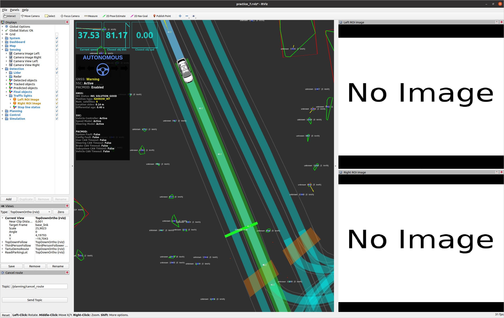
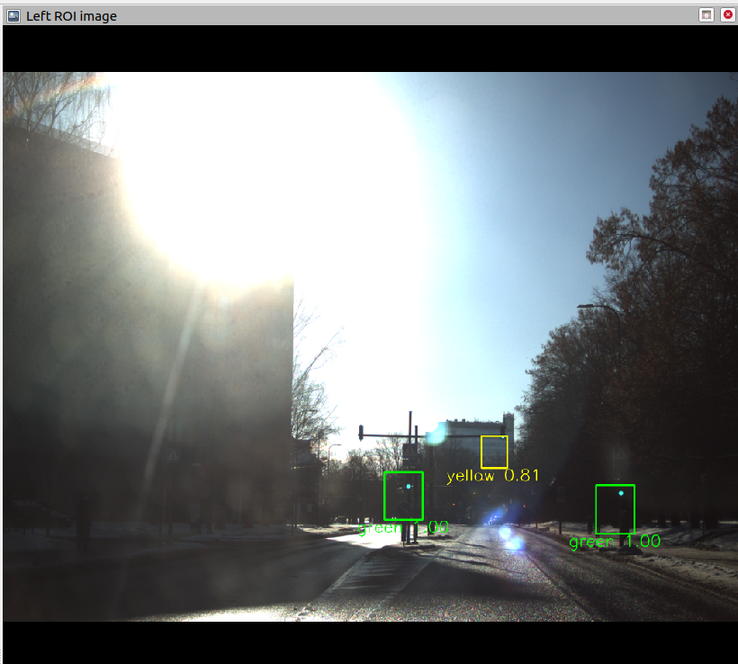
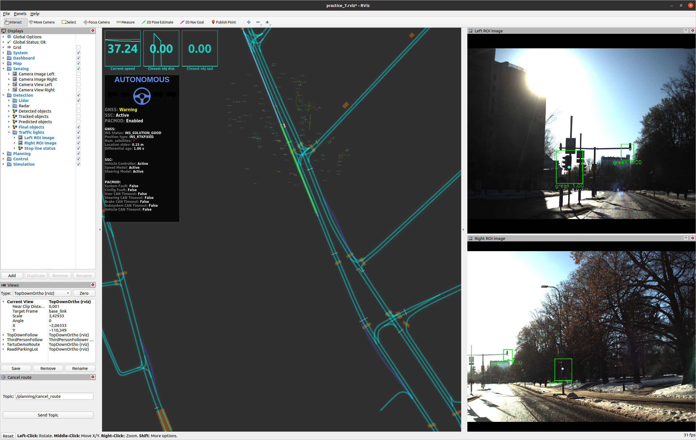

[< Previous practice](../practice_6) -- [**Main Readme**](../README.md) -- [Next practice >](../practice_8)

# Practice 7 - Traffic light detection

The task for this practice is to implement camera-based traffic light detection. You will use the rosbag, and your task is to implement parts of the  `camera_traffic_light_detector` node and add traffic light support to the local planner. 

The main functionality of the `camera_traffic_light_detector` node:
* subscribe to the camera image topic
* subscribe to the lanelet2 map and extract the traffic light locations from the map
* project traffic lights onto the image and extract the bounding boxes
* send images to a neural network (model provided) for classification
* publish the classification results


Additionally, you will need to add additional small node that will process stopping traffic lights as collision points to complement the logic of the existing local planner.

#### Additional files
- [launch/practice_7.launch](launch/practice_7.launch) - a launch file that should run without errors at the end of the practice
- [rviz/practice_7.rviz](rviz/practice_7.rviz) - RViz config file for visualizing the topics.


### Expected outcome
* Understand how the traffic light bounding box images are extracted from the image and how they are sent to the neural network model for classification.
* A node that extracts bounding box images of traffic lights and outputs the classification results for the local planner to react to traffic lights' changing statuses.
* Understanding how the traffic light statuses are converted to collision points in the local planner.


## 1. Preparation

Create the node `camera_traffic_light_detector` under `nodes/detection/`, copy the following code and familiarize yourself with the existing structure, parameters and functionality.

    ```
    #!/usr/bin/env python3

    import rospy
    import numpy as np
    import cv2
    import threading
    import tf2_ros
    import onnxruntime
    from lanelet2.io import Origin, load
    from lanelet2.projection import UtmProjector
    from image_geometry import PinholeCameraModel
    from shapely.geometry import LineString

    from geometry_msgs.msg import Point, PointStamped
    from sensor_msgs.msg import Image
    from sensor_msgs.msg import CameraInfo
    from autoware_mini.msg import TrafficLightResult, TrafficLightResultArray
    from autoware_mini.msg import Path
    from tf2_geometry_msgs import do_transform_point

    from cv_bridge import CvBridge, CvBridgeError


    # Classifier outputs 4 classes (LightState)
    CLASSIFIER_RESULT_TO_STRING = {
        0: "green",
        1: "yellow",
        2: "red",
        3: "unknown"
    }

    CLASSIFIER_RESULT_TO_COLOR = {
        0: (0,255,0),
        1: (255,255,0),
        2: (255,0,0),
        3: (0,0,0)
    }

    CLASSIFIER_RESULT_TO_TLRESULT = {
        0: 1,   # GREEN
        1: 0,   # YELLOW
        2: 0,   # RED
        3: 2    # UNKNOWN
    }

    class CameraTrafficLightDetector:
        def __init__(self):

            # Node parameters
            onnx_path = rospy.get_param("~onnx_path")
            self.rectify_image = rospy.get_param('~rectify_image')
            self.roi_width_extent = rospy.get_param("~roi_width_extent")
            self.roi_height_extent = rospy.get_param("~roi_height_extent")
            self.min_roi_width = rospy.get_param("~min_roi_width")
            self.transform_timeout = rospy.get_param("~transform_timeout")
            # Parameters related to lanelet2 map loading
            coordinate_transformer = rospy.get_param("/localization/coordinate_transformer")
            use_custom_origin = rospy.get_param("/localization/use_custom_origin")
            utm_origin_lat = rospy.get_param("/localization/utm_origin_lat")
            utm_origin_lon = rospy.get_param("/localization/utm_origin_lon")
            lanelet2_map_name = rospy.get_param("~lanelet2_map_name")

            # global variables
            self.trafficlights = None
            self.tfl_stoplines = None
            self.camera_model = None
            self.stoplines_on_path = None

            self.lock = threading.Lock()
            self.bridge = CvBridge()
            self.model = onnxruntime.InferenceSession(onnx_path, providers=['CUDAExecutionProvider'])
            self.tf_buffer = tf2_ros.Buffer()
            self.tf_listener = tf2_ros.TransformListener(self.tf_buffer)

            # Load the map using Lanelet2
            if coordinate_transformer == "utm":
                projector = UtmProjector(Origin(utm_origin_lat, utm_origin_lon), use_custom_origin, False)
            else:
                raise RuntimeError('Only "utm" is supported for lanelet2 map loading')
            lanelet2_map = load(lanelet2_map_name, projector)

            # Extract all stop lines and signals from the lanelet2 map
            all_stoplines = get_stoplines(lanelet2_map)
            self.trafficlights = get_stoplines_trafficlights(lanelet2_map)
            # If stopline_id is not in self.signals then it has no signals (traffic lights)
            self.tfl_stoplines = {k: v for k, v in all_stoplines.items() if k in self.trafficlights}

            # Publishers
            self.tfl_status_pub = rospy.Publisher('traffic_light_status', TrafficLightResultArray, queue_size=1, tcp_nodelay=True)
            self.tfl_roi_pub = rospy.Publisher('traffic_light_roi', Image, queue_size=1, tcp_nodelay=True)

            # Subscribers
            rospy.Subscriber('camera_info', CameraInfo, self.camera_info_callback, queue_size=1, tcp_nodelay=True)
            rospy.Subscriber('/planning/local_path', Path, self.local_path_callback, queue_size=1, buff_size=2**20, tcp_nodelay=True)
            rospy.Subscriber('image_raw', Image, self.camera_image_callback, queue_size=1, buff_size=2**26, tcp_nodelay=True)


        def camera_info_callback(self, camera_info_msg):
            if self.camera_model is None:
                camera_model = PinholeCameraModel()
                camera_model.fromCameraInfo(camera_info_msg)
                self.camera_model = camera_model

        def local_path_callback(self, local_path_msg):

            # used in calculate_roi_coordinates to filter out only relevant signals
            stoplines_on_path = []

            with self.lock:
                self.stoplines_on_path = stoplines_on_path
                self.transform_from_frame = local_path_msg.header.frame_id

        def camera_image_callback(self, camera_image_msg):

            if self.camera_model is None:
                rospy.logwarn_throttle(10, "%s - No camera model received, skipping image", rospy.get_name())
                return

            if self.stoplines_on_path is None:
                rospy.logwarn_throttle(10, "%s - No path received, skipping image", rospy.get_name())
                return

            with self.lock:
                stoplines_on_path = self.stoplines_on_path
                transform_from_frame = self.transform_from_frame


        def calculate_roi_coordinates(self, stoplines_on_path, transform):
            pass

        def create_roi_images(self, image, rois):
            pass


        def publish_roi_images(self, image, rois, classes, scores, image_time_stamp):
            
            # add rois to image
            if len(rois) > 0:
                for cl, score, (_, _, min_u, max_u, min_v, max_v) in zip(classes, scores, rois):

                    text_string = "%s %.2f" % (CLASSIFIER_RESULT_TO_STRING[cl], score)
                    text_width, text_height = cv2.getTextSize(text_string, cv2.FONT_HERSHEY_SIMPLEX, 1.5, 2)[0]
                    text_orig_u = int(min_u + (max_u - min_u) / 2 - text_width / 2)
                    text_orig_v = max_v + text_height + 3

                    start_point = (min_u, min_v)
                    end_point = (max_u, max_v)
                    cv2.rectangle(image, start_point, end_point, color=CLASSIFIER_RESULT_TO_COLOR[cl] , thickness=3)
                    cv2.putText(image,
                        text_string,
                        org=(text_orig_u, text_orig_v),
                        fontFace=cv2.FONT_HERSHEY_SIMPLEX,
                        fontScale=1.5,
                        color=CLASSIFIER_RESULT_TO_COLOR[cl], 
                        thickness=2)

            image = cv2.resize(image, None, fx=0.5, fy=0.5, interpolation=cv2.INTER_LINEAR)
            img_msg = self.bridge.cv2_to_imgmsg(image, encoding='rgb8')
            
            img_msg.header.stamp = image_time_stamp
            self.tfl_roi_pub.publish(img_msg)


        def run(self):
            rospy.spin()


    def get_stoplines(lanelet2_map):
        """
        Add all stop lines to a dictionary with stop_line id as key and stop_line as value
        :param lanelet2_map: lanelet2 map
        :return: {stop_line_id: stopline, ...}
        """

        stoplines = {}
        for line in lanelet2_map.lineStringLayer:
            if line.attributes:
                if line.attributes["type"] == "stop_line":
                    # add stoline to dictionary and convert it to shapely LineString
                    stoplines[line.id] = LineString([(p.x, p.y) for p in line])

        return stoplines

    def get_stoplines_trafficlights(lanelet2_map):
        """
        Iterate over all regulatory_elements with subtype traffic light and extract the stoplines and sinals.
        Organize the data into dictionary indexed by stopline id that contains a traffic_light id and the four coners of the traffic light.
        :param lanelet2_map: lanelet2 map
        :return: {stopline_id: {traffic_light_id: {'top_left': [x, y, z], 'top_right': [...], 'bottom_left': [...], 'bottom_right': [...]}, ...}, ...}
        """
    
        signals = {}
    
        for reg_el in lanelet2_map.regulatoryElementLayer:
            if reg_el.attributes["subtype"] == "traffic_light":
                # ref_line is the stop line and there is only 1 stopline per traffic light reg_el
                linkId = reg_el.parameters["ref_line"][0].id
    
                for tfl in reg_el.parameters["refers"]:
                    tfl_height = float(tfl.attributes["height"])
                    # plId represents the traffic light (pole), one stop line can be associated with multiple traffic lights
                    plId = tfl.id
    
                    traffic_light_data = {'top_left': [tfl[0].x, tfl[0].y, tfl[0].z + tfl_height],
                                          'top_right': [tfl[1].x, tfl[1].y, tfl[1].z + tfl_height],
                                          'bottom_left': [tfl[0].x, tfl[0].y, tfl[0].z],
                                          'bottom_right': [tfl[1].x, tfl[1].y, tfl[1].z]}
    
                    # signals is a dictionary indexed by stopline id and contains dictionary of traffic lights indexed by pole id
                    # which in turn contains a dictionary of traffic light corners
                    signals.setdefault(linkId, {}).setdefault(plId, traffic_light_data)
    
        return signals
    ```

##### Validation
* run `roslaunch autoware_mini_practice_solutions practice_7.launch tfl_detector:=mqtt`
   - should run with no errors, and stop line statuses should be seen on the map in RViz (GREEN api, RED api etc...). 
   - you should be able to add the goal point (place it further away along the road past the stop line) and see the path appear, but there is no reaction to the traffic light if it is RED, not even in target velocity. That is because the functionality is missing from the local planner.
      - no images present in Left and Right bounding box image
      - there should be a topic `/detection/traffic_light_status` where with the rate of 10Hz traffic light statuses extracted from MQTT server are published.
* run `roslaunch autoware_mini_practice_solutions practice_7.launch tfl_detector:=camera`
   - still no images present in RViz (Left and Right bounding box image)

   

   - The topic `/detection/traffic_light_status` is there, but has something been published? Check with `rostopic echo` and `rostopic hz`
   - run `rosnode info /detection/camera1/camera_traffic_light_detector` in another console to see the names of the topics `camera_traffic_light_detector` outputs:

        ```
        Node [/detection/camera1/camera_traffic_light_detector]
        Publications: 
        * /detection/camera1/traffic_light_roi [sensor_msgs/Image]
        * /detection/camera1/traffic_light_status [autoware_msgs/TrafficLightResultArray]
        * /rosout [rosgraph_msgs/Log]

        Subscriptions: 
        * /camera1/camera_info [sensor_msgs/CameraInfo]
        * /camera1/image_raw [sensor_msgs/Image]
        * /planning/local_path [autoware_msgs/Lane]
        * /tf [tf2_msgs/TFMessage]
        * /tf_static [tf2_msgs/TFMessage]
        ```

   - If checked they should be empty and nothing is published there. 


## 2. Publish camera images for preview

At the end of this task, we want to have the following topics being published from the `camera_traffic_light_detector` node
* `/detection/camera1/traffic_light_roi`
* `/detection/camera1/traffic_light_status`
* `/detection/camera2/traffic_light_roi`
* `/detection/camera2/traffic_light_status`

We have to do it in `camera_image_callback` - whenever a new image appears, this callback will process it and provide the source data for the previously mentioned topics.

* To the `.../traffic_light_roi` topic, an image is published, and there is already an existing publisher for that `self.tfl_roi_pub`. The image should be overlayed with bounding boxes that are coloured according to classification results. You should use the existing function `publish_roi_images` for image publishing.

   

* `.../traffic_light_status` topic has traffic light results in [`TrafficLightResultArray`](https://github.com/autowarefoundation/autoware_ai_messages/blob/master/autoware_msgs/msg/TrafficLightResultArray.msg) that contains [`TrafficLightResult`](https://github.com/autowarefoundation/autoware_ai_messages/blob/master/autoware_msgs/msg/TrafficLightResult.msg) message, and the publisher for that one is `self.tfl_status_pub`.


As a starting point in this task, we will assume first that there are no traffic lights on the path, and we will create just an empty `TrafficLightResultArray` for `.../traffic_light_status` and for the `.../traffic_light_roi` we are going to load the image and pass it on as is.

##### Instructions

1. Create `TrafficLightResultArray()` message and use the publisher (`self.tfl_status_pub`) to publish it.
    - make sure that the message timestamp is taken from the image message
2. Load the image
    ```
    image = self.bridge.imgmsg_to_cv2(camera_image_msg,  desired_encoding='rgb8')
    ```
3. There is a parameter `self.rectify_image`; if true, add image rectification. Note that it includes `camera_model`, and its existence is checked at the beginning of the callback (if it is None, the callback returns with a warning)
    ```
    self.camera_model.rectifyImage(image, image)
    ```
4. Use `self.publish_roi_images` to publish a loaded image. You can create all the additional variables needed for `self.publish_roi_images` as empty lists.

##### Validation
* `roslaunch autoware_mini_practice_solutions practice_7.launch tfl_detector:=camera`
* There should be a camera image present within RViz
* echo the topics with --noarr argument and verify that messages are published `rostopic echo --noarr /detection/camera1/traffic_light_roi`

    


## 3. Get the stop lines on the path

In the next step, we want to know if our path has stop lines linked with traffic lights. The stop line determines the stopping point and related traffic lights should all show the same status, weather it is red, yellow, greem etc. The information on traffic light locations and to which stop line status they determine is recorded in the lanelet2 map relations. We will use the lanelet2 map and extract relevant traffic lights to the global variable `self.tfl_stoplines` by checking which stop lines intersect with local path. `self.tfl_stoplines` should be the dictionary containing `stoplineId` as the key and stop line geometry (shapely line string) as a value.


##### Instructions
1. A local variable in `camera_image_callback` called `stoplines_on_path` gets its value from the global variable `stoplines_on_path = self.stoplines_on_path`
    - add a printout of `stoplines_on_path`
    - run `roslaunch autoware_mini_practice_solutions practice_7.launch tfl_detector:=camera`
    - add the goal point further than the stop line on the path
    - It should print out an empty list, although we have the stop line on the path
2. Find out where the `self.stoplines_on_path` is assigned and add the code that will check the intersection of stop lines and local path and add `stoplineId` in the list if they intersect.
3. The code should be executed only when there is a local path (waypoints)
4. To use shapely [intersects](https://shapely.readthedocs.io/en/stable/reference/shapely.intersects.html) both geometries must be shapely linestrings.
    ```
    local_path.intersects(stopline)
    ```
5. Add `stoplineId` to the list if it intersects with the local path

##### Validation
* run `roslaunch autoware_mini_practice_solutions practice_7.launch tfl_detector:=camera`
* add the goal point further than the stop line on the path
* `stoplineId` of intersecting stop line should be printed out


## 4. Extract traffic light bounding boxes
The previous fix shows us that there are stop lines linked with traffic lights on the path. Now, we should use that information and start extracting bounding boxes around the traffic lights to send them to classification. So essentially, the `rois = []` will be the list of coordinates that specify where on the camera image we can find the bounding box area around the traffic light.

If we have a local path and know that there is a stop line on it, we have yet to determine if the traffic light (we will have it in map coordinates) is actually within the camera image limits. So we need to get the transform from the map frame to the camera frame, use the stop line id to get the associated traffic lights and transform all of their locations from the map frame to the camera frame. Then, we can calculate them into pixel coordinates and see if they are on the image.

It should be evident that cameras can have 
- different viewing angle when approaching the traffic light (imagine an overtaking manoeuvre or turning road),
- different angles because of how they are attached to the car,
- and different fields of view (camera model).


##### Instructions
1. In the `camera_image_callback` add check if we have stop lines on our local path
2. Under the previous check, use the already created transform listener to extract the `transform`
    - transform **to** frame should be taken from camera image message
    - transform **from** frame is taken from the local path and should be already present as local variable `transform_from_frame`
    - You can use [Task 5, point 3](../practice_5/README.md#5-get-data-in-cluser_detector-node) as an example of how to get transform
3. To get the rois use `self.calculate_roi_coordinates` function by passing on `stoplines_on_path` and `transform`
4. Copy the code below into the `calculate_roi_coordinates` function and remove the `pass`

    ```
    rois = []

    for linkId in stoplines_on_path:
        for plId, traffic_lights in self.trafficlights[linkId].items():
            us = []
            vs = []

            for x, y, z in traffic_lights.values():
                point_map = Point(float(x), float(y), float(z))

                # TODO

                # convert the extent in meters to extent in pixels
                extent_x_px = self.camera_model.fx() * self.roi_width_extent / point_camera.z
                extent_y_px = self.camera_model.fy() * self.roi_height_extent / point_camera.z

                us.extend([u + extent_x_px, u - extent_x_px])
                vs.extend([v + extent_y_px, v - extent_y_px])

            # not all traffic lights were in image, take next traffic light
            if len(us) < 8:
                continue

            # round and clip against image limits
            us = np.clip(np.round(np.array(us)), 0, self.camera_model.width - 1)
            vs = np.clip(np.round(np.array(vs)), 0, self.camera_model.height - 1)

            # extract one roi per traffic light
            min_u = int(np.min(us))
            max_u = int(np.max(us))
            min_v = int(np.min(vs))
            max_v = int(np.max(vs))

            # check if roi is too small
            if max_u - min_u < self.min_roi_width:
                continue

            rois.append([int(linkId), plId, min_u, max_u, min_v, max_v])

    return rois

    ```

5. Find the **TODO** in the pasted code; there you have to implement the following:
    - `point_map` variable is used to extract map coordinates for every traffic light corner within the traffic light (`plId`)
    - transform `point_map` to camera frame: `point_camera = do_transform_point(PointStamped(point=point_map), transform).point`
    - transform point in the camera frame to pixel coordinates: `u, v = self.camera_model.project3dToPixel((point_camera.x, point_camera.y, point_camera.z))`
    - use the camera model to check if the resulting pixel coordinate is within the image (if not, it can be skipped - out of the image) `if u < 0 or u >= self.camera_model.width or v < 0 or v >= self.camera_model.height`
6. Go through the rest of the code in the function and try to understand what is going on there.
7. Add the printout to `rois` in the `camera_image_callback`


##### Validation
* run `roslaunch autoware_mini_practice_solutions practice_7.launch tfl_detector:=camera`
* add the goal point further than the stop line on the path
* we should see the `stoplineId` and the rois alternate in the printout

    ```
    stoplines_on_path: [5000051]
    rois: [[5000051, 2000225, 683, 741, 1113, 1186]]
    stoplines_on_path: [5000051]
    rois: [[5000051, 2000585, 1722, 1787, 1080, 1162], [5000051, 2000225, 1881, 1970, 1173, 1284], [5000051, 2001115, 1483, 1547, 1201, 1281]]
    stoplines_on_path: [5000051]
    rois: [[5000051, 2000585, 1710, 1776, 1077, 1160], [5000051, 2000225, 1873, 1963, 1170, 1283], [5000051, 2001115, 1469, 1534, 1199, 1280]]
    stoplines_on_path: [5000051]
    rois: [[5000051, 2000225, 673, 732, 1110, 1184]]
    ```


## 5. Classification of traffic light images

The previous step gave us `rois` - Traffic light bounding box pixel coordinates with respect to camera images. Next, we must crop out the bounding box images and send them to classification.

##### Instructions
1. Add processing of `rois` if there are any
2. use `self.create_roi_images` function to extract `roi_images`.
3. The code for the function is below. In the code, you will find the `# TODO` where you have to add the following
    - select the area from the image defined by min and max of `u` and `v`
    - selected area needs to be resized to 128x128 pixels, use [`cv2.resize`](https://docs.opencv.org/3.4/da/d54/group__imgproc__transform.html#ga47a974309e9102f5f08231edc7e7529d) and linear interpolation
    - add resulting image to `roi_images` by converting it to float `image.astype(np.float32)`

    ```
    roi_images = []
    for _, _, min_u, max_u, min_v, max_v in rois:
        # TODO

    return np.stack(roi_images, axis=0) / 255.0
    ```
4. Back in the `camera_image_callback` after the `roi_images` are created, we need to run the model and get predictions for each image
    ```
    # run model and do prediction
    predictions = self.model.run(None, {'conv2d_1_input': roi_images})[0]
    ```
5. Add the printout to `predictions`


##### Validation
* run `roslaunch autoware_mini_practice_solutions practice_7.launch tfl_detector:=camera`
* add the goal point further than the stop line on the path
* There should be the following printouts similar to the one below

    ```
    stoplines_on_path: [5000051]
    rois: [[5000051, 2000585, 1659, 1727, 1064, 1150], [5000051, 2000225, 1835, 1929, 1158, 1277], [5000051, 2001115, 1408, 1476, 1191, 1276]]
    predictions: [[7.4583195e-18 9.5790565e-01 8.2869640e-12 4.2094342e-02]
    [8.5229117e-18 1.4532727e-01 4.1015051e-06 8.5466868e-01]
    [1.5137553e-04 4.7089124e-01 5.2813113e-01 8.2628924e-04]]
    stoplines_on_path: [5000051]
    rois: [[5000051, 2000225, 647, 710, 1102, 1181]]
    predictions: [[1.4973022e-20 1.1364074e-05 2.1817709e-10 9.9998868e-01]]
    ```


## 6. Extract results from predictions
Now we have the predictions! As we can see, there is a list with 4 numbers for every bounding box.
* The index of the number shows the classifier result code. See the dictionaries at the beginning of the code. For example, see the `CLASSIFIER_RESULT_TO_STRING` dictionary. It shows the corresponding string for each index.
* Each float in the list has confidence level from 0 to 1. We want to take the highest confidence as the final result.

##### Instructions
1. Extract `classes` for each bounding box from predictions
2. Extract `scores` (maximum probability value) for each bounding box from predictions
3. Now you can use the following code to extract classes in sync with rois
4. Replace TODOs with the correct conversion with the help of defined dictionaries.

    ```
    # extract results in sync with rois
    for cl, (stoplineId, plId, _, _, _, _) in zip(classes, rois):

        tfl_result = TrafficLightResult()
        tfl_result.light_id = plId
        tfl_result.stopline_id = stoplineId
        tfl_result.recognition_result =  # TODO
        tfl_result.recognition_result_str = # TODO

        tfl_status.results.append(tfl_result)
    ```

##### Validation
* run `roslaunch autoware_mini_practice_solutions practice_7.launch tfl_detector:=camera`
* add the goal point further than the stop line on the path
* You should see the overlayed traffic lights in the RViz

    

* echo the traffic light results topic `rostopic echo /detection/camera1/traffic_light_status`

    ```
    ---
    header: 
    seq: 102
    stamp: 
        secs: 1683546392
        nsecs: 556972024
    frame_id: ''
    results: 
    - 
        light_id: 2000585
        recognition_result: 1
        recognition_result_str: "green"
        lane_id: 5000051
    - 
        light_id: 2001115
        recognition_result: 1
        recognition_result_str: "green"
        lane_id: 5000051
    ---
    ```


## 7. Add functionality to the local planner

We now have the traffic light results, but we still need the logic in the local planner to act upon them. For this, we add another type of collision points to `collision_points_manager` node. The overall process is similar to the task 9 from the previous practice.

##### Instructions
1. Lookup in the `planning.yaml` config the rest of the parameters that are needed for the traffic light stop line collision points creation. 
2. Create subscriber to `/detection/traffic_light_status` topic that copies and stores the results of traffic light detection method.
```
rospy.Subscriber('/detection/traffic_light_status', TrafficLightResultArray, self.traffic_light_status_callback, queue_size=1, tcp_nodelay=True)
```
3. Add corresponding logic for converting the traffic light status to collision points. The logic is similar to the one used for the goal point collision points: we need to find if the buffered local path intersects with traffic light location, and if the traffic light status `stopline_statuses[stopline_id]` is red or yellow.
4. Correctly initialize the collision points setting the `collision_pdistance_to_stop = self.braking_safety_distance_stoplineoint_type`, `deceleration_limit = np.inf`, and `category = 2`.
5. Append the collision point to the array of collision points in the `collision_points_manager` node before publishing it as `PointCloud2` message.

##### Validation
* run `roslaunch autoware_mini_practice_solutions practice_7.launch tfl_detector:=camera`
* put the rosbag play into pause (hit space in the console) and add the goal point further than the stop line on the path
* in the second console run: `rostopic echo /detection/traffic_light_status | grep recognition_result_str`
* Continue playing with the bag and see how the statuses are printed out.
* Notice that we slowly slow down before second traffic light, as it is red. Your closest object distance value in rviz should smoothly descent, together with the required target speed, before coming to stop at exactly the projected stopline.
* Play the whole bag out and see how your planner react to every red traffic light occurence. You can monitor your planner behaviour by the `target_velocity` and `closest_object_distance` in the RViz, or open the rqt topic monitor and look at what is published by your collision points manager.

[//]: # (## 8. Check the deceleration)

[//]: # ()
[//]: # (The car would brake very sharply when approaching a traffic light, and it turns red just before crossing the stop line. Unfortunately, the typical driver's behaviour is accelerating with a "blinking yellow". That is why we need to add a more complex logic to `deceleration_limit`. If braking because of the traffic light exceeds a specific limit, we should ignore the red status and not brake. The goal is to ensure that cars following us would not drive into us because of our very sharp and possibly unexpected braking.)

[//]: # ()
[//]: # (##### Instructions)

[//]: # (1. Add deceleration calculation to `simple_local_planner`, the formula:)

[//]: # ()
[//]: # (    ![deceleration_formula]&#40;images/deceleration_formula.png&#41;)

[//]: # ()
[//]: # (2. If the deceleration exceeds the parameter `tfl_maximum_deceleration` value &#40;need to add getting it&#41;, the ego vehicle should not react to a red stop line. The parameter is loaded from the `config/planning.yaml` file and is "private" to this node.)

[//]: # (3. When the ego vehicle ignores the braking for the red stop line, a `logwarn` message should be printed out in the console with [`throttle`]&#40;http://wiki.ros.org/rospy/Overview/Logging#Logging_Periodically&#41; of 3 seconds, not to overflood the console with messages at 10Hz.)

[//]: # ()
[//]: # ()
[//]: # (##### Validation)

[//]: # (* run `roslaunch autoware_mini_practice_solutions practice_7.launch tfl_detector:=camera`)

[//]: # (* add the goal point further than the stop line on the path)

[//]: # (* Observe that the status at the end is still briefly detected as RED, but )

[//]: # (    - there is no target velocity drop in the target velocity graph, and )

[//]: # (    - the console has printed out a warning message about ignoring the stop line)

[//]: # ()
[//]: # (        ```)

[//]: # (        [WARN] [1711378477.980142]: /planning/simple_local_planner - ignore red traffic light, deceleration: 8.608831)

[//]: # (        ``` )


### Finalize the code
* Clean the code of any debugging printouts and add comments where necessary.
* Commit the code to git and push it to your remote repository.
