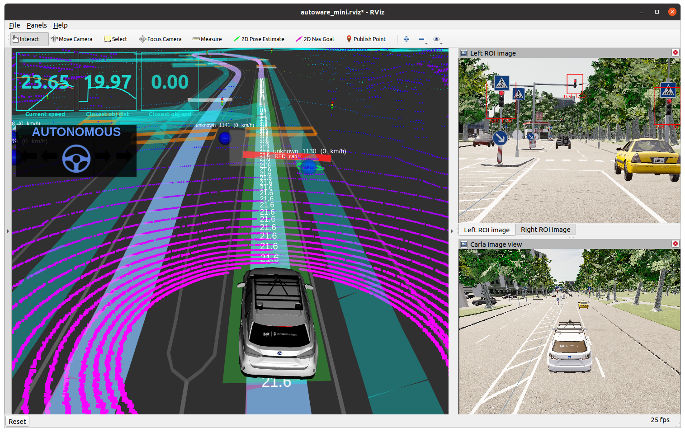
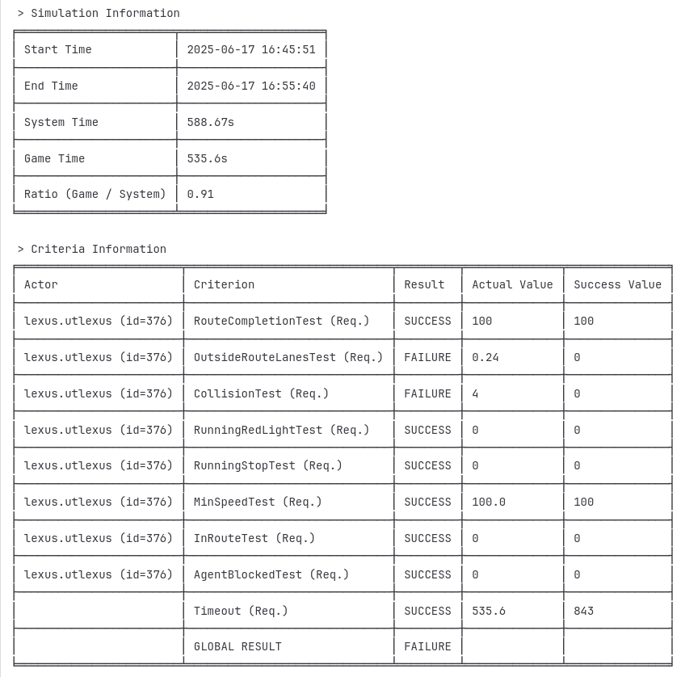

[< Previous practice](../practice_7) -- [**Main Readme**](../README.md)

# Practice 8 - CARLA simulator with Scenario Runner

Task for this practice is to drive full Route Scenario in Carla simulation using your own autonomous driving framework. More specifically you will use following nodes written during previous practices:

* `localizer`
* `pure_pursuit_follower`
* `lanelet2_global_planner`
* `local_path_extractor`,`collision_points_manager` and `simple_speed_planner`

You are provided with final launch file [launch/practice_8.launch](launch/practice_8.launch) and RViz config file [rviz/practice_8.rviz](rviz/practice_8.launch) that utilizes all mentioned nodes and substitutes other useful nodes and CARLA simulator setup from `autoware_mini`. 



## 1. Run CARLA simulation with Scenario Runner

[Launching CARLA simulation](https://github.com/UT-ADL/autoware_mini?tab=readme-ov-file#launching-carla-simulation).

1. Run Carla. 
    ```
    $CARLA_ROOT/CarlaUE4.sh -prefernvidia -quality-level=Low -RenderOffScreen
    ```
2. From `autoware_mini_practice_solutions` launch `practice_8.launch` with scenario runner running route
    ```
    roslaunch autoware_mini_practice_solutions practice_8.launch use_scenario_runner:=true route_id:=1
    ```
3. Demonstrate performance of your framework at the practice session
4. Once the route scenario finishes it will output final results (see below for example). Save the Simulation information and Criteria information in "practice_8_simulation_1.txt".

5. Commit the results in your repo